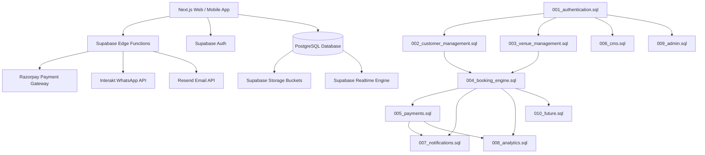

# MSC OS (Maqbool Sports Complex Operating System) - Architecture Blueprint

An enterprise-grade, high-throughput sports facility operating system backend built on **Supabase**, **PostgreSQL**, **TypeScript**, and **Serverless Edge Functions**.

---

## High-Level System Architecture

---

## Core Systems & Engine Design

### 1. Concurrency-Safe Booking Lock Engine (`004_booking_engine.sql`)
- **Problem**: Preventing double bookings under peak concurrent requests (e.g. 100 players attempting to book the same Friday evening turf slot at 6:00 PM).
- **Solution**:
  1. Transaction Advisory Lock (`pg_advisory_xact_lock`) serialized on the hashed `venue_id`.
  2. 5-Minute TTL Temporary Slot Locks stored in `slot_locks`.
  3. Overlap check query evaluated against active locks (`expires_at > NOW()`) and confirmed bookings (`booking_status IN ('confirmed', 'in_progress', 'locked')`).
  4. Automatic lock release trigger and background cleanup worker (`release-expired-slots`).

### 2. Dynamic Pricing Engine (`003_venue_management.sql`)
- **Base Rate vs. Peak Rates**: Priority-ordered pricing rules matrix evaluating day of week, time of day (e.g. 5:00 PM - 11:00 PM floodlight surcharge), weekend rates, and custom seasonal dates.
- **Resource Surcharges**: Automatic extra cost addition for optional sub-allocations like automated bowling machines.

### 3. Financial & Tax Invoice Engine (`005_payments.sql`)
- **Payment Lifecycle**: `pending` -> `authorized` -> `captured` -> `refunded`.
- **Automatic Invoice Generation**: Generates official tax invoices with sequence format `INV-YYYY-XXXX`, breaking down subtotal, 18% GST, and grand total.
- **Razorpay Callback & Webhook Verification**: Signature verification via Edge Functions (`payment-webhook`, `razorpay-webhook`).

### 4. Asynchronous Outbox Notification Engine (`007_notifications.sql`)
- **Decoupled Messaging**: Automated database trigger `tr_booking_notif_queue` enqueues confirmation messages into `notification_queue`.
- **Retry Mechanism**: Exponential backoff retry loop with max retries and error logging via `notification-queue` worker.
- **Provider Adapters**: Resend (HTML Emails) & Interakt (WhatsApp Templates).

---

## Security Architecture & Row Level Security (RLS)

1. **Defense in Depth**: Every single table has RLS explicitly enabled (`ALTER TABLE ... ENABLE ROW LEVEL SECURITY;`).
2. **Role-Based Access Control (RBAC)**: Security Definer helper functions:
   - `get_current_user_role()`
   - `is_staff()` (Super Admin, Owner, Reception)
   - `is_owner()` (Super Admin, Owner)
   - `has_permission(user_id, permission_code)`
3. **Data Isolation**: Customers can only view and mutate their own profile, bookings, devices, and invoices. Staff members possess elevated management scope.

---

## Storage Architecture (10 Buckets)

- **`avatars`**: User profile pictures (Public)
- **`gallery`**: High-res facility photos & videos (Public)
- **`venues`**: Turf & net promotional images (Public)
- **`hero`**: Landing page hero banners & background media (Public)
- **`logos`**: Complex logos & branding SVG assets (Public)
- **`testimonials`**: Customer review media (Public)
- **`receipts`**: General payment receipts (Public)
- **`booking-receipts`**: Auto-generated PDF tax invoices (Public)
- **`admin-assets`**: Internal reports & administrative media (Public)
- **`documents`**: Private contracts, corporate tax IDs, legal identity documents (Private - Staff Only)

---

## Scalability & Performance Strategy (100,000+ Users)

1. **Database Indexing**:
   - Trigram GIN indexes on text fields (`full_name`, `booking_number`, `phone`) for sub-millisecond search.
   - Composite B-Tree indexes on temporal queries (`(venue_id, start_time, end_time)`).
   - Partial indexes on pending notification items and active coupons.
2. **Materialized Views**:
   - `mv_daily_revenue_analytics`
   - `mv_hourly_occupancy_heatmap`
   - `mv_customer_retention_metrics`
   - Refresh executed concurrently (`REFRESH MATERIALIZED VIEW CONCURRENTLY`) via daily cron Edge Function.
